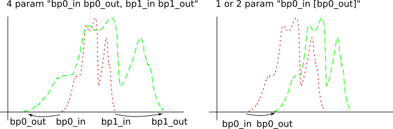

# GBDXM Model Support

## General Parameters
General parameters are ones that are used during processing regardless of the
type of model.  They may be used to determine the appropriate input imagery.
```
  -l [ --labels ] PATH                  Labels file name.
  --label-names LABEL1 [LABEL2 ...]     A list of label names.
  -w [ --model-size ] WIDTH [HEIGHT]    Classifier model size. Model parameters
                                        will override this if present.
  -c [ --color-mode ] MODE              Color mode. Model parameters will 
                                        override this if present. Must be one 
                                        of the following: grayscale, rgb, 
                                        multiband
```

### Color Mode
 - `grayscale` - The model and data must be single band.
 - `rgb` - The model and data must be 3 band, and transformations will be made
 to have a consistent color order.
 - `multiband` - The model and data may be any matching number of bands
 
 
## Caffe

Currently supported is the [NVIDIA branch of Caffe at version 15](https://github.com/NVIDIA/caffe/tree/caffe-0.15).  Except for where noted below,
only the stock C++ layers are supported.  Caffe was originally developed by the
[Berkeley Artificial Intelligence Research](http://caffe.berkeleyvision.org/) 
(BAIR) Lab (formerly known as the Berkeley Vision and Learning Center (BVLC)).

### Options

```
-C [ --category ] CATEGORY            Model category (optional). The 
                                      supported categories are: classifier, 
                                      detectnet, segmentation.
--caffe NAME VALUE [NAME VALUE ...]   Set multiple Caffe options.
--caffe-model PATH                    Caffe model topology file name.
--caffe-trained PATH                  Caffe model weights file name.
--caffe-mean PATH                     Caffe model mean values file name 
                                      (optional).
--caffe-output-layer VALUE            Output layer name (optional).
```

### General Notes

### Classifier Category

A classifier accepts a patch of the input image and determines the likelihood that
it is each of the known labels.

Input layer:
 - _Input image_ of size {`batch size`, `number of channels`, `image height`, 
 `image width`}.
 
Output layer:
 - _Confidences_ of size {`batch size`, `number of labels`}.  This must be in the
 top of the network.  Each element refers to the likelihood that that label
 describes the image.  The labels must be ordered in the same order as they are
 in the model metadata.  If "output-layer" is not specified and only one Sigmoid
 or Softmax layer exists on the top of the model, it will be used.

### Segmentation Category

A segmentation model performs pixel by pixel classification of the input image
and generates a confidence per label confidence mask.  Pixels in each label above
a confidence are vectorized into polygons for output.  The confidence of each
polygon is the average of the pixels that are contained within it.

Input layer:
 - _Input image_ of size {`batch size`, `number of channels`, `image height`, 
 `image width`}.
 
Output layer:
 - _Confidences_ of size {`batch size`, `number of labels`, `image height`,
 `image width`}.  The `output-layer` must be specified if multiple layers exist
 at the top of the network.

### DetectNet Category

One detection model that is implemented for Caffe, is for NVIDIA's
[DetectNet](https://devblogs.nvidia.com/detectnet-deep-neural-network-object-detection-digits/)
as implemented within their [DIGITS](https://developer.nvidia.com/digits) training 
system.  Normally, a python layer is used to gather results and generate bounding boxes.
During inference, this layer is removed and replaced by comparable code in DeepCore.

Input layer:
 - _Input image_ of size {`batch size`, `number of channels`, `image height`, 
 `image width`}.
 
Output layer:
 - _Coverage_ of size {`batch size`, `number of labels`, `height`, `width`}.  
 This must be named "coverage". It is interpreted as the confidence score of the
 bounding box.
 - _BBoxes_  of size {`batch size`, 4, `height`, `width`}. This must be named 
 "bboxes".  Boxes are interpreted in the order "Left", "Top", "Right", "Bottom".

Notes:
 - The `height` and `width` of the outputs are related, but not the same as the
 image size.  These dimensions must be of the same in each output layer.
 - The "output-layer" parameter is ignored.


## TensorFlow

### Options

```
-C [ --category ] CATEGORY            Model category. The supported 
                                      categories are: detector, classifier, 
                                      segmentation.
--tensorflow NAME VALUE [NAME VALUE ...]
                                      Set multiple TensorFlow options.
--tensorflow-model PATH               A frozen TensorFlow model file name.
--tensorflow-input-layer VALUE (=input)
                                      Image input layer name (optional).
--tensorflow-input-datatype VALUE (=float)
                                      Image input DataType. Overridden if 
                                      given input-layer has the data type 
                                      attribute (optional). Allowed values 
                                      are: int8, uint8, int16, uint16, int32,
                                      int64, float, double.
--tensorflow-output-layers VALUE (=output)
                                      Output layer name(s), comma separated 
                                      (optional).
--tensorflow-confidence-layer VALUE   Input confidence threshold layer name 
                                      (optional).
--tensorflow-linear-stretch VALUE (=0.0 1.0 0.0 1.0)
                                      Stretch the values in the source.  Four
                                      parameters are required in the form 
                                      'breakpoint0_in breakpoint0_out 
                                      breakpoint1_in breakpoint1_out', 
                                      'breakpoint_in breakpoint_out', or 
                                      'shift' (constants may be used for 
                                      calculations from the source) 
                                      (optional).
```

#### Linear Stretch

Linear stretch allows for preprocessing of the image's dynamic range using 1 or 2
breakpoints.  All calculations are performed for every value in the image, without
regard to channel.

In the one breakpoint version, 1 or 2 parameters are given to shift each pixel's
value down by some amount.  If only one parameter is given, the second
is default to 0.  For example:

 - "mean 256", shift the mean of the image to 256
 - "50", shift the image down by 50 (i.e. subtract)

In the two breakpoint version, breakpoints are used to define a linear mapping.
No clamping is performed.  For example:

 - "min 0, max 1", scales and shifts each subset to the range 0-1.
 - "median(5) 0, median(95) 255", stretches subsets so that the 5% and 95% medians
   are mapped to 0 and 255



Each parameter may be a constant, or one of the following methods.  Calculations
are performed for each subset of the image.

 - "min" - The minimum of the image
 - "max" - The maximum of the image
 - "mean" - The mean of the image
 - "stddev" - The stddev of the image
 - "stddev(xx.xx)" - A xx.xx multiple of the stddev of the image (e.g. "stddev(-1)" is -1 * stddev)
 - "median" - The median of the image
 - "median(xx.xx)" - The xx.xx median of the image (e.g. "median(5)" is the 5% median)
 - "xx.xx" - A constant value
 - "constant(xx.xx)" - A constant value

### General Notes

In release 1.1, gbdxm neither infers nor validates any parameters from the
TensorFlow input.  This include `--category`, `--color-mode`, `--model-size`, etc.

TensorFlow refers to elements in the graph which hold data and operations as
"Tensors" and input data as a "Placeholder Tensor".  To be consistent with the
naming established by Caffe, these will be referred to as "Layers" and "Input
Layers", respectively.
        
### Classifier Category

A classifier accepts a patch of the input image and determines the likelihood that
it is each of the known labels.

Input layers:
 - _Input image_ of size {`batch size`, `image height`, `image width`,
 `number of channels`}.
 - (Optional) _Confidence_ scalar.  It must be specified in the model metadata
 if and only if this exists in the model.

Output layer:
 - _Data_ of size {`batch size`, `number of labels`}.  Each element refers to 
 the likelihood that that label describes the image.  Data must be ordered
 to correspond with the order of the labels in the model metadata.

### Detector Category

The detector in TensorFlow 

Input layers:
 - _Input image_ of size {`batch size`, `image height`, `image width`,
 `number of channels`}.
 - (Optional) _Confidence_ scalar.  It must be specified in the model metadata
 if and only if this exists in the model.

Output layers, which must be specified in the following order:
 - _Bounding boxes_ of size {`number of detections`, 4}.  Order of each bounding
 box is "Top", "Bottom", "Left", "Right".
 - _Scores_ of size {`number of detections`, 1}
 - _Classes_ of size {`number of detections`, 1}.  Each class refers to the
 0-based index of the labels given in the model metadata.
 - _Number of detections_ a vector of size {`batch size`}.
 
Note that for the _Bounding boxes_, _Scores_, and _Classes_ layers, detections
are concatenated from each batch.  _Number of detections_ can be used to split
each tensor into batches.  For instance, given the following:

 - _Classes_ {1, 2, 1, 2, 2, 3, 1, 2}
 - _Number of detections_ {1, 3, 1, 3}

_Classes_ would be split by batch into {{1}, {2, 1, 2}, {2}, {3, 1, 2}} and
similarly for _Scores_ and _Bounding Boxes_.
 

## Metadata Parameters
The following parameters are not used in processing, but are stored in the model
so that the model can be applied to suitable input data.
```
-n [ --name ] NAME                    Model name.
-V [ --version ] VERSION              Model version.
-d [ --description ] DESCRIPTION      Model description.
--date-time DATE_TIME                 Date/time the model was created 
                                      (optional). Default is the current date
                                      and time. Must be in the following ISO 
                                      format: YYYYMMDDTHHMMSS[.ffffff], where
                                      'T' is the literal date-time separator.
-b [ --bounding-box ] W S E N         Training area bounding box (optional). 
                                      Must specify four coordinates: west 
                                      longitude, south latitude, east 
                                      longitude, and north latitude. e.g. 
                                      --bounding-box -180 -90 180 90
-r [ --resolution ] WIDTH [HEIGHT]    Model pixel resolution (optional).
```
